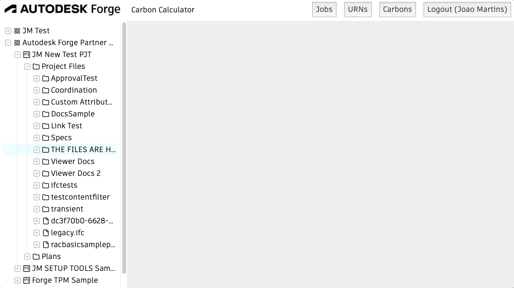

# Compound Material Layers Extractor
NodeJs service to Extract materials from Revit file on BIM 360/ACC


refer to: https://forge.autodesk.com/blog/custom-properties-using-design-automation

## System Diagram

*the new on uses only DA4R for extraction


## Getting Started
### 1.START SERVER

```> node server.js```

> JSON server running on port 8000

### MongoDB

You'll need a MongoDB Atlas Database available for this sample to work.
Refer [here](https://www.mongodb.com/basics/mongodb-atlas-tutorial) for setup (you can use the free tier) and [here](https://www.mongodb.com/en-us/basics/create-database) for Database creation.

Once you've done that, you'll need to add values for `MONGO_CONNECTION_STRING` and `MONGO_DB_NAME` environment variables under launch.json.
`MONGO_CONNECTION_STRING` will be the connection string to your Database.
`MONGO_DB_NAME` will be the name of your Database.

This sample will use 5 collections named `allinstances`, `carbons`, `deduplicated`, `jobs` and `urns`. If you don't create those, they'll be create at first time you run a successfull extraction.

___
### OPEN BROWSER



1. login with the upper right button with your Autodesk account
2. Select a revit viewable from the tree on the left
3. The selection will trigger a workitem
4. You can track the status through Jobs button
5. Once it finishes, you should be able to retrieve URN results

...
